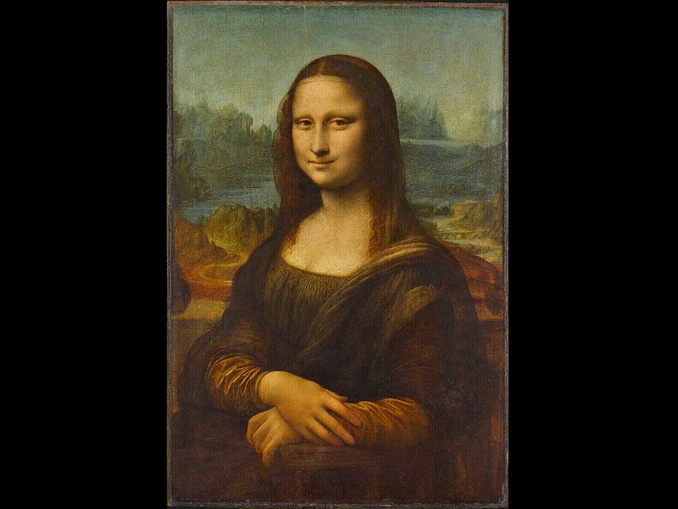

# :smiling_imp: **IMP**: _Icon Mosaicking in Python_
-----------------------


## Description
Python module for flexible, corpus-based icon mosaicking. Here are some emoji-art examples made with **IMP**.


<div align="center">
	
	
	
	
</div>


## Acknowledgements
This code is a Python porting and expansion of [emoji-mosaic](https://github.com/ericandrewlewis/emoji-mosaic) by [ericandrewlewis](https://github.com/ericandrewlewis/), and inspired by [Yung Jake](https://en.wikipedia.org/wiki/Yung_Jake)'s [emoji art](https://www.nytimes.com/2017/07/26/style/emoji-portraits-yung-jake.html).

## Installation
To install the latest version of **IMP** with pip, run:
```shell
pip install imp-kit
```

## Datasets
A convenient corpus dataset that works well with **IMP** is [Kaggle](https://www.kaggle.com)'s *Full Emoji Image Dataset*, which you can download [here](https://www.kaggle.com/datasets/subinium/emojiimage-dataset?resource=download).


## License
ISC License
Copyright (c) 2023, Felipe Tovar-Henao

Permission to use, copy, modify, and/or distribute this software for any purpose with or without fee is hereby granted, provided that the above copyright notice and this permission notice appear in all copies.

THE SOFTWARE IS PROVIDED "AS IS" AND THE AUTHOR DISCLAIMS ALL WARRANTIES WITH REGARD TO THIS SOFTWARE INCLUDING ALL IMPLIED WARRANTIES OF MERCHANTABILITY AND FITNESS. IN NO EVENT SHALL THE AUTHOR BE LIABLE FOR ANY SPECIAL, DIRECT, INDIRECT, OR CONSEQUENTIAL DAMAGES OR ANY DAMAGES WHATSOEVER RESULTING FROM LOSS OF USE, DATA OR PROFITS, WHETHER IN AN ACTION OF CONTRACT, NEGLIGENCE OR OTHER TORTIOUS ACTION, ARISING OUT OF OR IN CONNECTION WITH THE USE OR PERFORMANCE OF THIS SOFTWARE.

## TO DO
Create Poisson-like section filter whereby dominant colors are constrasting enough